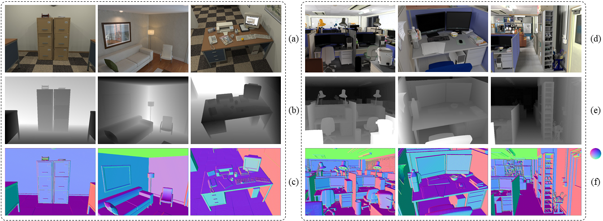
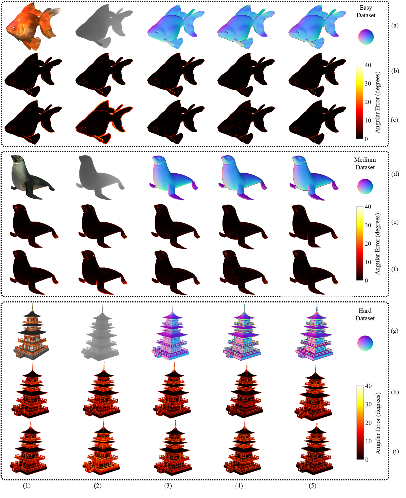

# Three-Filters-to-Normal (3F2N): An Accurate and Ultrafast Surface Normal Estimator

<p align="center">

</p>

*<sup>(a) RGB images; (b) Depth/Disparity Images; (c) Surface Normal Inferences.</sup>*

## 1. Publication:
This [paper](https://arxiv.org/pdf/2005.08165.pdf) (arxiv preprint) was accepted to RA-L and ICRA'21. In this repository, we publish our MATLAB, C++, and CUDA code. 

Please cite our [paper](https://ieeexplore.ieee.org/document/9381580) (IEEE published version) when using our source code or datasets:
```
@article{fan2021-3f2n,
  title={Three-filters-to-normal: 
  an accurate and ultrafast surface normal estimator},
  author={Fan, Rui and Wang, Hengli and Xue, Bohuan and Huang,
   Huaiyang and Wang, Yuan and Liu, Ming and Pitas, Ioannis},
  journal={IEEE Robotics and Automation Letters (RA-L)},
  doi={10.1109/LRA.2021.3067308},
  year={2021}
}
```
<hr style="height:2px;border-width:0;color:gray;background-color:gray">

## 2. Contributions:

Rui Ranger Fan proposed 3F2N and completed the MATLAB and CUDA code; Bohuan Xue completed the C++ code; Hengli Wang and Huaiyang Huang created the large-scale datasets that were used for quantifying algorithm performance; Huaiyang Huang explored the application of 3F2N in 3-D reconstruction; Yuan Wang studied the usability of CNN in 3F2N; Hengli Wang and Bohuan Xue carried out algorithm evaluations; Ming Liu and Ioannis Pitas provided comments and suggestions on paper writing. [Rui Ranger Fan](https://github.com/ruirangerfan), [Hengli Wang](https://github.com/hlwang1124), and [Bohuan Xue](https://github.com/byronsit) contributed equally to this work. 

<hr style="height:2px;border-width:0;color:gray;background-color:gray">

## 3. Demo Video:
In this [video](https://www.youtube.com/watch?v=a_TdEHzvB5I), we demonstrated: (a) the performance of 3F2N w.r.t. different filter types/sizes; (b) comparisons between 3F2N and other SoTA algorithms; (c) experimental results on other public datasets containing depth/disparity images; (d) application of 3F2N in SLAM. Our proposed 3F2N can also be used for semantic driving scene segmentation tasks, as discussed in [SNE-RoadSeg, ECCV'21](https://arxiv.org/pdf/2008.11351.pdf).

<p align="center">

</p>

<hr style="height:2px;border-width:0;color:gray;background-color:gray">

## 4. Datasets

This project used 24 3-D mesh models from [Free3D](https://free3d.com/) to create three datasets (eight models in each dataset). According to different difficulty levels, we name our datasets **easy, medium, and hard**, respectively. Each 3-D mesh model is first fixed at a certain position. A virtual range sensor with pre-set intrinsic parameters is then used to capture depth images at 1800–2500 different view points. At each view point, a 480x640 pixel depth image is generated by rendering the 3-D mesh model using OpenGL Shading Language (GLSL). However, since the OpenGL rendering process applies linear interpolation by default, rendering surface normal images is infeasible. Hence, the surface normal of each triangle, constructed by three mesh vertices, is considered to be the ground truth surface normal of any 3-D points residing on this triangle. **The [datasets](https://sites.google.com/view/3f2n/datasets) are publicly available for research purposes**.

<p align="center">

</p>

*<sup>(1)–(5) columns on (a), (d) and (g) rows show the 3-D mesh models, depth images, surface normal ground truth
and the experimental results obtained using FD-Mean and FD-Median SNEs (ours), respectively; (1)–(5) columns on (b), (e) and (h) rows show the angular error
maps obtained by PlaneSVD/PlanePCA, VectorSVD, AreaWeighted, AngleWeighted, and FALS SNEs, respectively; (1)–(5) columns on
(c), (f) and (i) rows show the angular error maps obtained by SRI, LINE-MOD, SNE-RoadSeg, FD-Mean and FD-Median SNEs, respectively.</sup>*

<hr style="height:2px;border-width:0;color:gray;background-color:gray">

## 5. Source Code

### 5.1. Matlab code

Navigate to [matlab_code](https://github.com/ruirangerfan/three_filters_to_normal/tree/master/matlab_code) and run `demo.m`, a result and the corresponding error map (degrees) will be displayed.

### 5.2. C++ code

Step 1: Install [Eigen](https://eigen.tuxfamily.org/dox/) library and [OpenCV](https://opencv.org/).

```
sudo apt-get install libeigen3-dev
sudo apt-get install libopencv-dev
```


Step 2: Run the following commands:

```
mkdir c_code/build
cd c_code/build
cmake ..
make 
./example
```

### 5.3. CUDA code

Similar to the C++ code, please use CMake to build the environment and run `main.cu`.

<hr style="height:2px;border-width:0;color:gray;background-color:gray">

## 6. Contact

Please feel free to drop me emails (Rui Fan, [rui.fan@ieee.org](rui.fan@ieee.org)) if you have any questions.
